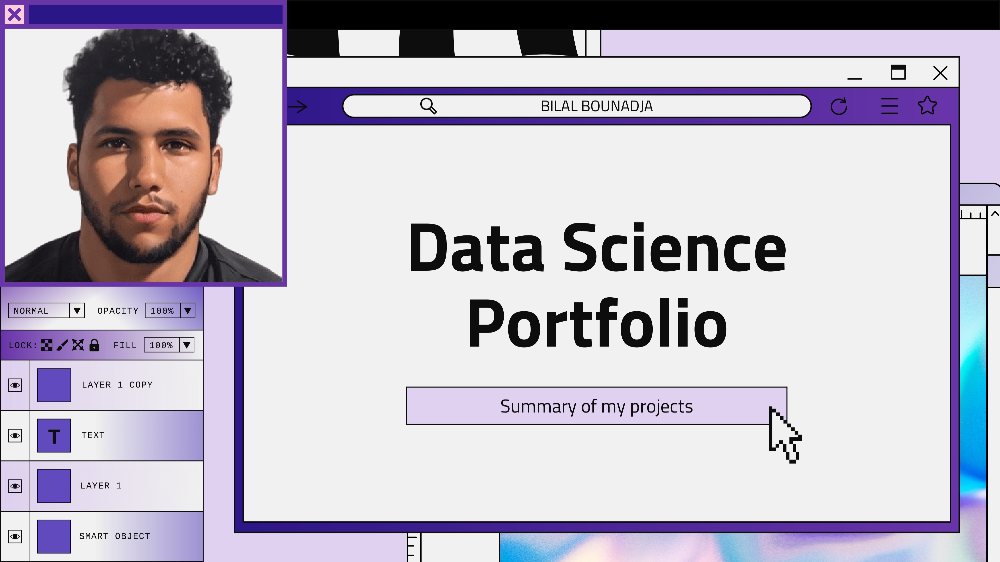
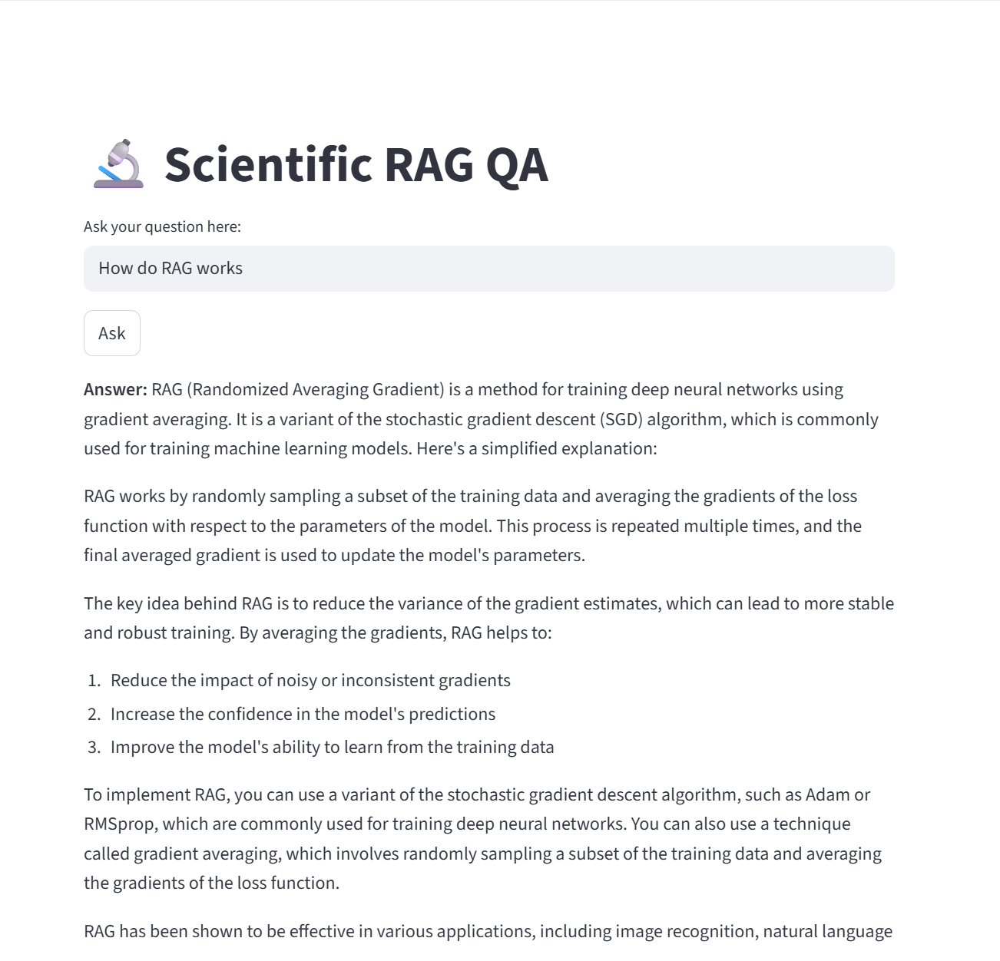
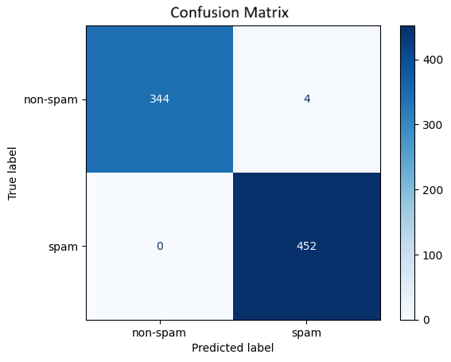
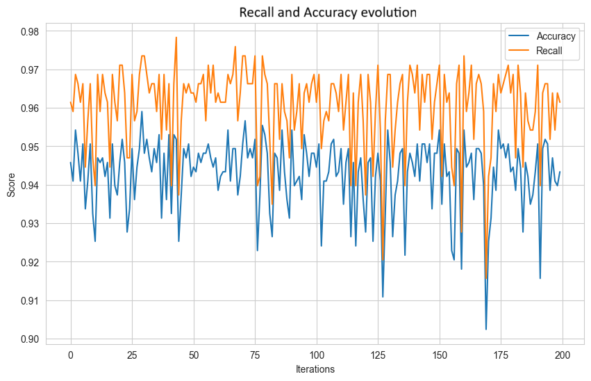
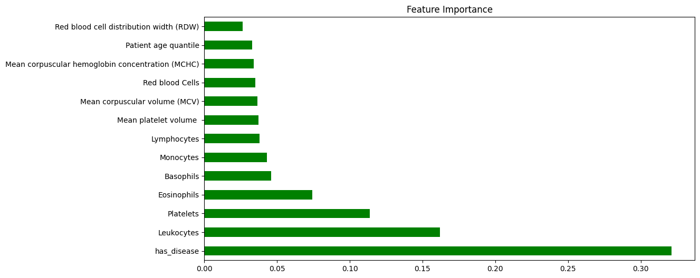

# Hello 🖐️ , I’m Bilal Bounadja, welcome to my portfolio, if you have any questions feel free to contact me.

👨‍💻 Data Scientist

---

## About Me

- 🎓 Master’s degree diploma in Robotics and AI (SAR), Sorbonne Université, graduated in 2023
- 🌱 Passionate about Scientific Research, AI, Biology.
- ⚡ Always curious and continuously learning new technologies and methodologies
- 📫 Contact: [Bilal.bndj@gmail.com] | [LinkedIn](https://www.linkedin.com/in/bilal-bounadja-data/)
---

## Skills

| Data Science                                                                                                        | Robotics & IoT                                                                                     | DevOps & Miscellaneous                                                                                           |
|---------------------------------------------------------------------------------------------------------------------|----------------------------------------------------------------------------------------------------|------------------------------------------------------------------------------------------------------------------|
|  Python          |  C++                |  Git                           |
|  TensorFlow   |  OpenCV                           |  GitLab               |
|  PyTorch               |  ROS                            |  Google Cloud       |
|  scikit-learn         |  C                                    |  Power BI                     |
|  Seaborn                                       |  Gazebo                |  Excel |
|  SQLServer                                  |  SolidWorks                                | LateX  |
|  FastAPI                                  |                       | AZURE  |

---

## Projects

- 💻  Data Science personnal projects
- 🤖  Robotics and IoT projects
- 🔒  Brief explanation without public code
  
### 💻[**RAG Fact-Checking System (2025)**](https://github.com/Corrosifu/RAG_Fact_Checking)

#### Context & Goal  
Developed a complete Retrieval-Augmented Generation (RAG) pipeline for **scientific fact-checking and pedagogical explanation**.  
The goal was to automate the retrieval, structuring, and synthesis of research papers from **arXiv**, enabling clear, verified scientific answers generated by lightweight AI models — fully executable on limited hardware (**≈ 4 GB VRAM + CPU**).

#### Methodology  
- **Data Ingestion:** Automated download and parsing of recent arXiv papers through the official API, extracting metadata and converting PDFs into **Markdown / JSON**.  
- **Chunking & Embedding:** Segmented texts with **SciBERT** tokenizer, generating normalized embeddings using **Qwen 3 0.6B** for FAISS indexing.  
- **Hybrid Retrieval:** Combined **semantic search (FAISS)** and **lexical search (BM25)**, then applied **MiniLM cross-encoder reranking** for higher precision.  
- **Generation:** Leveraged **LLaMA 3.2 1B-Instruct** to produce concise, didactic explanations built from retrieved contexts — designed to simplify complex scientific concepts.  
- **Deployment:** Containerized via **Docker Compose** (backend : FastAPI  |  frontend : Streamlit), deployable locally or on **Azure App Service**.

#### Results  
- Delivered a **fully functional RAG system** capable of sourcing, indexing, and generating responses from scientific literature.  
- Achieved **low-latency retrieval (~2 s/query on CPU)** and consistent, context-aware generation.  
- Demonstrated a reproducible end-to-end **explainable AI architecture** for research exploration and educational use.
  

---

For full technical documentation, architecture overview, and complete source code, visit the [project repository](https://github.com/Corrosifu/RAG_Fact_Checking).

### 💻[**Spam Detection Methods History (2025)**](https://github.com/Corrosifu/Spam_Detection/) 

#### Context & Goal
Developed a comprehensive spam detection system to classify emails/messages as spam or ham. The project explored both historical methods and modern machine learning techniques to improve detection accuracy and robustness.

#### Methodology
- Used datasets such as CEAS-08 and Kaggle samples.  
- Applied advanced text preprocessing: tokenization, lemmatization, and stop-word removal with Python libraries.  
- Compared multiple classifiers—from heuristic filters and Naive Bayes to Random Forest and XGBoost.  
- Fine-tuned a transformer-based DistilBERT model for state-of-the-art classification.

#### Results
  | Model                | Accuracy (Text Only) | F1-Score (Text Only) | Accuracy (Multiple Features) | F1-Score (Multiple Features) |
  |----------------------|---------------------|---------------------|------------------------------|------------------------------|
  | KNN                  | 80.4%               | 0.80                | 75.9%                        | 0.76                         |
  | Logistic Regression   | 98.1%               | 0.98                | 97.4%                        | 0.97                         |
  | Random Forest        | 98.5%               | 0.98                | 99.1%                        | 0.99                         |
  | XGBoost              | 98.1%               | 0.98                | 98.1%                        | 0.98                         |

DistilBERT fine-tuning achieved near-perfect F1 scores (**~99.5%**), outperforming traditional methods but requiring greater computational resources.

---

For full technical details and code, please refer to the project repository.

  
  

### 💻[**Covid-19 Case Prediction and Survival Analysis (2024)**](https://github.com/Corrosifu/covid19_diagnosis/)

#### Context & Goal

The project addresses the urgent challenge of detecting COVID-19 positive cases from clinical laboratory data collected during the pandemic at Hospital Israelita Albert Einstein, São Paulo, Brazil. The aim is to develop accurate and reliable machine learning models that help identify COVID-19 infections based on routine lab tests, under constraints of limited testing capacity and incomplete data.

#### Methodology

- **Dataset:** Anonymized patient data including SARS-CoV-2 RT-PCR results and various laboratory tests, standardized and cleaned.  
- **Handling Missing Data:** Columns with more than 90% missing values were removed. Missing values were imputed by feature-wise means, and new indicators such as "has_disease" were created to improve completeness.  
- **Data Balancing:** SMOTE technique was applied to mitigate class imbalance since negative cases dominate the dataset.  
- **Feature Analysis:** Correlation heatmaps were generated to explore relationships among lab features.  
- **Models Evaluated:** Classical machine learning algorithms including Random Forest, SVM, XGBoost, KNN, Logistic Regression, and ensembles.  
- **Evaluation Metrics:** Focused on Accuracy and Recall to balance overall correctness and sensitivity to true COVID positives.

#### Results

| Metric         | Score  |
|----------------|--------|
| Accuracy       | 0.909  |
| Recall         | 0.706  |
| AUC            | 0.824  |
| KS Statistic   | 0.648  |

- Random Forest and XGBoost delivered the best classification results.  
- High recall indicates strong ability to detect true positive COVID-19 cases, critical for health screening.  
- Limitations include a relatively small test set, missing data impacting model reliability, and the need for validation on new cohorts.

---

For complete details, preprocessing methods, model code, and visualizations, please visit the project repository.

  
  

### 🔒**Sales Forecasting for Jaeger-LeCoultre (2023)**  
#### Context / Job Goal

This internship was conducted at Jaeger-LeCoultre as part of the final year of the Master in Artificial Intelligence and Robotics. The objective was to leverage data science and machine learning techniques to optimize supply chain forecasting and enhance predictive accuracy of product demand.

#### Methodology

- Performed technological watch to analyze emerging trends and innovations to align strategic objectives.  
- Collaborated closely with various business units to identify relevant use cases, select key performance indicators (KPIs), and evaluate classical prediction tool performance.  
- Processed complex, multi-source datasets by grouping, sorting, and merging tables using BigQuery (Google Cloud Platform) and SQL Server for efficient data exploitation.  
- Developed predictive models using Python libraries such as Pandas, Seaborn for statistical analysis, and applied machine learning methods including LSTM, XGBoost, and Random Forest for time series modeling and forecasting.

### Results

- Achieved a weighted Mean Absolute Percentage Error (wMAPE) of 85% using XGBoost.  
- Improved prediction wMape by over 45% when compared to classical supply chain estimation methods.  
- Conducted thorough model evaluation adapting machine learning outcomes to operational performance needs.

### 🔒**Reinforcement Learning for Autonomous Parking (2022)** 

#### Context / Job Goal

This research internship at Sorbonne Université focused on model-based reinforcement learning with the aim to deepen understanding of advanced RL techniques and their applications to autonomous system control. The project targeted solving real-world control problems by implementing and optimizing reinforcement learning algorithms.

#### Methodology

- Conducted an extensive literature review to establish the state of the art in model-based reinforcement learning.  
- Implemented a bicycle dynamic model simulating an autonomous parking problem within the HighwayEnv environment from OpenAI Gym, coded in Python.  
- Applied advanced reinforcement learning algorithms including Linear Quadratic Regulator (LQR) control, Deep Deterministic Policy Gradient (DDPG), and Deep Q-Networks (DQN) for policy optimization and control.  
- Performed iterative model tuning and evaluation to improve autonomous system performance in simulated scenarios.

#### Results

- Successfully demonstrated autonomous parking task completion using both classical control (LQR) and deep reinforcement learning techniques (DDPG, DQN).  
- Validated the reinforcement learning framework’s effectiveness on a realistic control environment, highlighting strengths and limitations of each algorithm.  
- Provided groundwork for further research and development in applying reinforcement learning to complex robotic control tasks.

### 🤖**TurtleBot Autonomous Racing Project (2022)**  

  Designed and developed control algorithms for an autonomous TurtleBot capable of navigating race tracks with obstacle avoidance and trajectory tracking. Integrated multiple sensor inputs including LIDAR, RGB camera, and IMU within the Robot Operating System (ROS) framework. Employed Gazebo for realistic simulation testing. Applied computer vision techniques, including OpenCV for target color detection and image processing. Tuned PID controllers to optimize robot motion stability and speed while avoiding collisions on complex racecourse layouts.
  
---

## Connect with Me

  

